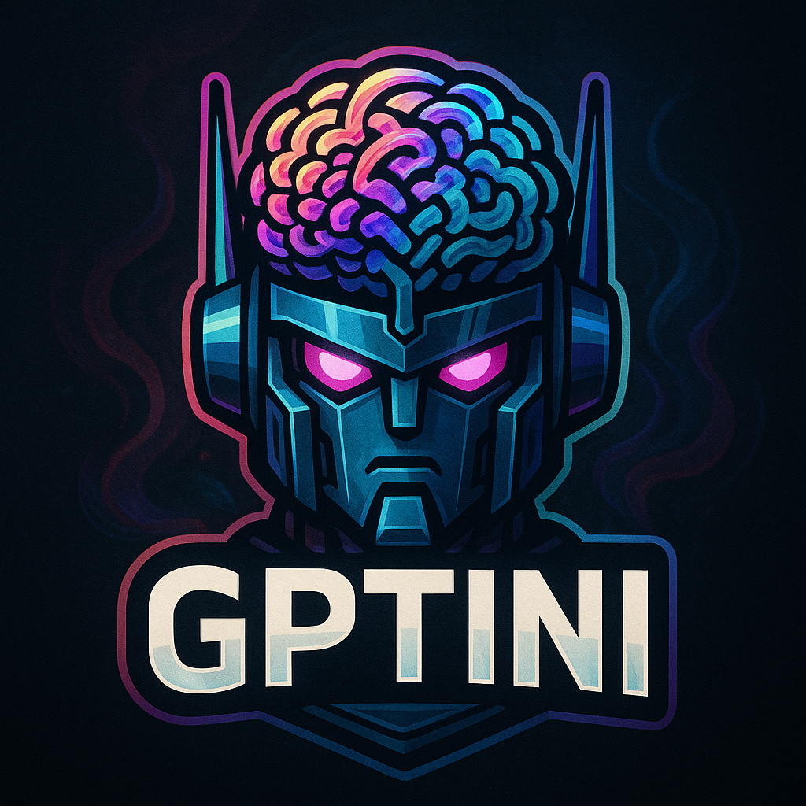

# GPTini

<br>

A simple yet powerful implementation of a Transformer-based language model in PyTorch. This project provides tools for training character-level language models and generating text.

## Features

- Transformer-based language model with multi-head attention
- Character-level tokenization for simplicity
- Simple interface for training and text generation
- Checkpoint saving and loading
- Optimized for RTX 4050 GPU
- Support for temperature, top-k, and top-p sampling

## Project Structure

```
GPTini/
├── config.py          # Configuration settings
├── model.py           # Transformer model implementation
├── train.py           # Training functionality
├── generate.py        # Text generation functionality
├── utils.py           # Utility functions
├── main.py            # Main entry point
└── README.md          # Documentation
```

## Requirements

```
torch>=1.10.0
```

## Getting Started

### 1. Clone the repository

```bash
git clone https://github.com/manohar3000/GPTini.git
cd GPTini
```

### 2. Prepare your dataset

Place your text file in the project directory. The default expected filename is `input.txt`.

### 3. Configure your model

Edit the `config.py` file to change any settings. The default configuration is optimized for an RTX 4050 GPU.

### 4. Run the program

```bash
python main.py
```

Follow the prompts to either train a new model or generate text with an existing model.

## Configuration

All settings are in `config.py`. The key parameters include:

- **Model Parameters**:
  - `N_EMBED`: Embedding dimension (default: 384)
  - `N_HEADS`: Number of attention heads (default: 6)
  - `N_LAYERS`: Number of transformer layers (default: 6)
  - `BLOCK_SIZE`: Maximum sequence length (default: 512)

- **Training Parameters**:
  - `BATCH_SIZE`: Number of sequences in a batch (default: 16)
  - `LEARNING_RATE`: Learning rate (default: 3e-4)
  - `MAX_ITERATIONS`: Number of training iterations (default: 10000)
  - `EVAL_INTERVAL`: Iterations between evaluations (default: 1000)

- **Generation Parameters**:
  - `DEFAULT_GEN_LENGTH`: Default number of characters to generate (default: 100)
  - `TEMPERATURE`: Sampling temperature (default: 1.0)
  - `TOP_K`: Top-k sampling parameter (default: 0, disabled)
  - `TOP_P`: Top-p (nucleus) sampling parameter (default: 0.9)

## Model Architecture

The language model is based on the Transformer architecture, similar to GPT:

- Character-level tokenization
- Token and positional embeddings
- Multiple layers of self-attention blocks
- Each block contains:
  - Multi-head self-attention
  - Layer normalization
  - Feed-forward neural network
- Causal attention masking to prevent looking ahead

## Examples

### Training

1. Edit `config.py` with your desired settings
2. Place your text data in `input.txt`
3. Run `python main.py` and select option 1

### Text Generation

1. Run `python main.py` and select option 2
2. Enter the path to your saved model (e.g., `model_checkpoints/final_model.pt`)
3. Enter a text prompt
4. Enter the number of characters to generate

## License

This project is open source and available under the MIT License.

## Acknowledgments

This implementation is inspired by the architecture of GPT models and various educational resources on transformer-based language models.