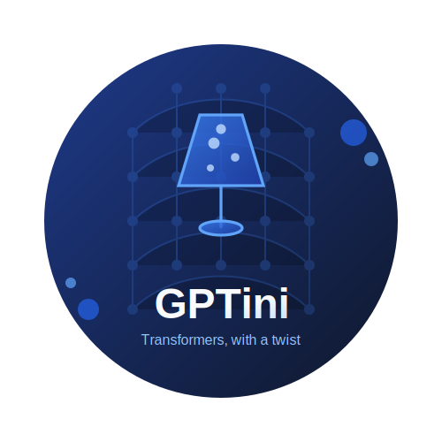

# ✨ GPTini

<div align="center">
  


**Craft powerful language experiences with minimal complexity**

[](https://pytorch.org/)
[](https://opensource.org/licenses/MIT)
[](https://www.python.org/downloads/)

</div>

## 🚀 Overview

GPTini is an elegant, lightweight implementation of a Transformer-based language model built with PyTorch. It combines the power of modern transformer architecture with a distilled, approachable design—perfect for experimentation, learning, and production deployment on consumer hardware.

Generate creative text, complete your thoughts, or build the foundation for your next NLP project with a model that's both sophisticated and accessible.

## ✨ Features

- **Transformer Architecture** — Advanced language modeling with multi-head attention mechanisms
- **Character-level Processing** — Simple yet effective tokenization for nuanced text generation
- **Intuitive API** — Clean interfaces for training models and generating text
- **Advanced Sampling** — Control creativity with temperature, top-k, and nucleus (top-p) sampling
- **Checkpoint Management** — Save and restore your trained models with ease

## 🏗️ Project Architecture

```
GPTini/
├── 📄 config.py          # Customizable configuration settings
├── 🧠 model.py           # Transformer neural architecture
├── 🔄 train.py           # Training engine and optimization
├── ✍️ generate.py        # Text generation and sampling logic
├── 🛠️ utils.py           # Helper functions and utilities
├── 🎮 main.py            # User interface and entry point
└── 📚 README.md          # Documentation (you are here!)
```

## 📋 Requirements

```
torch>=1.10.0
```

## 🚦 Getting Started

### 1. Clone the Repository

```bash
git clone https://github.com/manohar3000/GPTini.git
cd GPTini
```

### 2. Prepare Your Dataset

Place your text corpus in the project directory as `input.txt`. The richer your dataset, the more expressive your model!

### 3. Configure Your Model

Customize `config.py` to match your hardware capabilities and project goals. The default settings are optimized for RTX 4050 GPUs.

### 4. Launch GPTini

```bash
python main.py
```

Follow the interactive prompts to train a new language model or generate text with your existing creations.

## ⚙️ Configuration Options

Fine-tune your experience with these key parameters in `config.py`:

| Category | Parameter | Description | Default |
|----------|-----------|-------------|---------|
| **Model Design** | `N_EMBED` | Embedding dimensionality | 384 |
|  | `N_HEADS` | Attention heads | 6 |
|  | `N_LAYERS` | Transformer layers | 6 |
|  | `BLOCK_SIZE` | Sequence context length | 512 |
| **Training** | `BATCH_SIZE` | Batch size for training | 16 |
|  | `LEARNING_RATE` | Learning rate | 3e-4 |
|  | `MAX_ITERATIONS` | Training iterations | 10000 |
|  | `EVAL_INTERVAL` | Evaluation frequency | 1000 |
| **Generation** | `DEFAULT_GEN_LENGTH` | Default output length | 100 |
|  | `TEMPERATURE` | Output randomness | 1.0 |
|  | `TOP_K` | Top-k sampling cutoff | 0 (disabled) |
|  | `TOP_P` | Nucleus sampling threshold | 0.9 |

## 🧩 Model Architecture

GPTini implements a streamlined version of the GPT architecture:

- **Character-level Tokenization** — Works directly with characters for simplicity and flexibility
- **Dual Embeddings** — Combines token and positional information
- **Multi-layer Transformer** — Stacked self-attention blocks for deep contextual understanding
- **Attention Blocks** — Each containing:
  - Multi-head self-attention for capturing relationships between tokens
  - Layer normalization for training stability
  - Feed-forward networks for transformation and representation
- **Causal Masking** — Prevents the model from "seeing the future" during processing

## 📜 License

This project is available under the MIT License - see the LICENSE file for details.

## 🙏 Acknowledgments

GPTini draws inspiration from:
- The groundbreaking GPT architecture by OpenAI
- The PyTorch ecosystem and community
- Educational resources on transformer-based language models

---

<div align="center">
  
**GPTini** — Big language model energy in a small, elegant package.

[Report Issue](https://github.com/manohar3000/GPTini/issues) · [Request Feature](https://github.com/manohar3000/GPTini/issues) · [Contribute](https://github.com/manohar3000/GPTini/pulls)

</div>